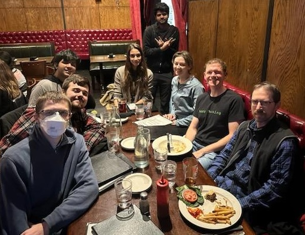

Here are the details for the next open source meetup:

- When: Sunday, Feb. 8th, 2026 at 7pm
- Where: [Hamilton Restaurant & Bar][], 1366 Beacon Street, Brookline, MA 02446 ([Google Maps][hamilton_gmaps]) ([OpenStreetMap][hamilton_osm])
- Discuss: [2026-02 thread](https://osdc.zulipchat.com/#narrow/channel/406743-boston/topic/2026-02.20meetup/near/569990834) on Zulip

<!--
- Where: [Hamilton Restaurant & Bar][], 1366 Beacon Street, Brookline, MA 02446 ([Google Maps][hamilton_gmaps]) ([OpenStreetMap][hamilton_osm])
- Where: [Silhouette Lounge][], 200 Brighton Ave, Allston, MA 02134 ([Google Maps][sil_gmaps])
- Where: [Mamacita][], 329 Huntington Ave, Boston, MA 02115 ([Google Maps][mamacita_gmaps]) ([OpenStreetMap][mamacita_osm])
- Where: [Time Out Market Boston][], 401 Park Dr, Boston, MA 02215 ([Google Maps][tob_gmaps])
- Where: [Grendel's Den][], 89 Winthrop St, Cambridge, MA 02138 ([Google Maps][grendels_gmaps])
- Where: [Bow Market][], 1 Bow Market Way, Somerville, MA 02143 ([Google Maps][bow_gmaps]) ([OpenStreetMap][bow_osm])
-->

[Hamilton Restaurant & Bar]: https://hamiltonbrookline.com
[hamilton_gmaps]: https://goo.gl/maps/Xn9q3wVHF5Q4jJsZA
[hamilton_osm]: https://www.openstreetmap.org/node/2340615787

[Mamacita]: https://mamacitaboston.com
[mamacita_gmaps]: https://maps.app.goo.gl/cmmWjghJSSGcKRLQ7
[mamacita_osm]: https://www.openstreetmap.org/node/1914792389

[Artisans Asylum]: https://www.artisansasylum.com
[artisans_gmaps]: https://maps.app.goo.gl/qGo3cgqziveQvydQ7
[artisans_osm]: https://www.openstreetmap.org/node/11011208188

[Charles River Speedway]: https://charlesriverspeedway.com
[crs_gmaps]: https://maps.app.goo.gl/GJDeiwGj455X6Exx9
[crs_osm]: https://www.openstreetmap.org/way/29631604

[Time Out Market Boston]: https://www.timeout.com/time-out-market-boston
[tob_gmaps]: https://maps.app.goo.gl/Rxc91vumkD2PRJmu8

[Grendel's Den]: https://www.grendelsden.com
[grendels_gmaps]: https://maps.app.goo.gl/1RE9sKSvbpKXrpQ17

[Bow Market]: https://www.bowmarketsomerville.com
[bow_gmaps]: https://maps.app.goo.gl/7PMEXgehNYjeXVnx9
[bow_osm]: https://www.openstreetmap.org/way/1330341631

[Brighton Music Hall]: https://crossroadspresents.com/pages/brighton-music-hall
[bmh_gmaps]: https://maps.app.goo.gl/KQUug7SRKHKUsyz37

[Silhouette Lounge]: https://www.silhouetteallston.com
[sil_gmaps]: https://maps.app.goo.gl/7b1diXSvivMALFys5

These meetups are extremely casual. Often [we](https://bostonopen.github.io/people) are around 5-7 people. We eat. We chat. We talk about open source. We talk about all kinds of things. Whether you're an experienced open source developer or user, or you're just curious about open source, you're welcome to join!

You can just show up, but since we are always asked how large of a table we need, we appreciate you letting us know if you're coming. You can post on [Zulip][], <a rel="me" href="https://floss.social/@bostonopen">Mastodon</a>, [Signal Group][] or [GitHub Discussions][]. Or you can email <philipdurbin@gmail.com>.

[GitHub Discussions]: https://github.com/orgs/bostonopen/discussions
[Zulip]: https://osdc.zulipchat.com/#narrow/stream/406743-boston
[Mastodon]: https://floss.social/@bostonopen
[Signal Group]: https://signal.group/#CjQKIGoh9--iomqNWoG9reLXz9RaAnDC_O1bw1BOk3gZlexUEhDy9Tes9s26HYi_bg5voUBE

We use the default [code of conduct](CODE_OF_CONDUCT.md) from GitHub, which says we want "an open, welcoming, diverse, inclusive, and healthy community."

Once you have attended a meetup, we'd love for you to add yourself to [bostonopen.dev/people](https://bostonopen.dev/people)! The file to edit is [people.tsv][].

[people.tsv]: https://github.com/bostonopen/people/blob/main/people.tsv

See you soon!

Previous meetups:

- 2026-02 4 people ([pics!](https://osdc.zulipchat.com/#narrow/channel/406743-boston/topic/2026-02.20meetup/near/572662613))
- 2026-01 Skipped! Snow emergency declared! ❄️
- 2025-12 3 people
- 2025-11 5 people ([pics!](https://osdc.zulipchat.com/#narrow/channel/406743-boston/topic/2025-11.20meetup/near/558924085))
- 2025-10 4 people
- 2025-09 7 people ([pics](https://osdc.zulipchat.com/#narrow/channel/406743-boston/topic/2025-09.20meetup/near/540677611))
- 2025-08 15 people ([pics!](https://floss.social/@bostonopen/115006739381797224))
- 2025-07 3 people ([pics!](https://osdc.zulipchat.com/#narrow/channel/406743-boston/topic/2025-07.20meetup/near/529716409))
- 2025-06 7 people ([Artisans Asylum](https://osdc.zulipchat.com/#narrow/channel/406743-boston/topic/Artisans.20Asylum/near/518933008), [pics!](https://osdc.zulipchat.com/#narrow/channel/406743-boston/topic/2025-06.20meetup/near/523011365))
- 2025-05 3 people
- 2025-04 7 people
- 2025-03 5 people
- 2025-02 11 people ([pics!](https://osdc.zulipchat.com/#narrow/channel/406743-boston/topic/2025-02.20meetup/near/501437654))
- 2025-01 5 people ([Mamacita](https://osdc.zulipchat.com/#narrow/channel/406743-boston/topic/Mamacita/near/486822871), [pics!](https://floss.social/@bostonopen/113830228361120420))
- 2024-12 8 people ([pics!](https://floss.social/@bostonopen/113619966982663396))
- 2024-11 9 people ([pics!](https://floss.social/@bostonopen/113550742212323250))
- 2024-10 7 people ([pics!](https://floss.social/@bostonopen/113382201446352054))
- 2024-09 9 people ([pics!](https://floss.social/@bostonopen/113201277312192479))
- 2024-08 4 people
- 2024-07 4 people
- 2024-06 6 people ([pics!](https://floss.social/@bostonopen/112717247483527395))
- 2024-05 12 people ([pics!](https://floss.social/@bostonopen/112391629552015967))
- 2024-04 8 people ([pics!](https://floss.social/@bostonopen/112351334360963966))
- 2024-03 7 people
- 2024-02 5 people
- 2024-01 7 people
- 2023-12 7 people
- 2023-11 7 people ([pics!](https://floss.social/@bostonopen/111400315116089590))
- 2023-10 6 people
- 2023-09 10 people
- 2023-08 Skipped! Summer vacation! 🏖️
- 2023-07 Skipped! Summer vacation! 🏖️
- 2023-06 3 people
- 2023-05 7 people
- 2023-04 11 people
- [2023-03](http://blog.greptilian.com/2023/02/17/open-source-meetup-in-brookline-3/) 11 people
- 2023-02 Skipped!
- [2023-01](http://blog.greptilian.com/2023/01/03/open-source-meetup-in-brookline-2/) 11 people
- [2022-12](http://blog.greptilian.com/2022/12/10/open-source-meetup-in-brookline/) 10 people
