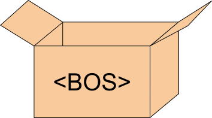

Hello! Our May meetup will be held just after [LibrePlanet 2024][]:

- When: Sunday, May 5, 2024 at 7pm
- Where: [Hamilton Restaurant & Bar][], 1366 Beacon Street, Brookline, MA 02446 ([Google Maps][])

(We posted it as a [birds-of-a-feather][] event.)

Pleae note that this is two hours later than our usual time.

[Hamilton Restaurant & Bar]: https://hamiltonbrookline.com
[Google Maps]: https://goo.gl/maps/Xn9q3wVHF5Q4jJsZA
[LibrePlanet 2024]: https://libreplanet.org/2024/
[birds-of-a-feather]: https://libreplanet.org/wiki/LibrePlanet:Conference/2024/BOF#Sunday_Night_Meetup_with_Boston_Open_Dev

These meetups are extremely casual. Often [we](https://bostonopen.github.io/people) are around 7-10 people. We eat. We chat. We talk about open source. We talk about all kinds of things. Whether you're an experienced open source developer or user, or you're just curious about open source, you're welcome to join!

You can just show up, but since we are always asked how large of a table we need, we appreciate you letting us know if you're coming. You can post on [Zulip][], <a rel="me" href="https://floss.social/@bostonopen">Mastodon</a>, or [GitHub Discussions][]. Or you can email <philipdurbin@gmail.com>.

[GitHub Discussions]: https://github.com/orgs/bostonopen/discussions
[Zulip]: https://osdc.zulipchat.com/#narrow/stream/406743-boston
[Mastodon]: https://floss.social/@bostonopen

Once you have attended a meetup, we'd love for you to add yourself to [bostonopen.dev/people](https://bostonopen.dev/people)! The file to edit is [people.tsv][].

[people.tsv]: https://github.com/bostonopen/people/blob/main/people.tsv

See you soon!

Previous meetups:

- 2024-05 12 people ([pics!](https://floss.social/@bostonopen/112391629552015967))
- 2024-04 8 people ([pics!](https://floss.social/@bostonopen/112351334360963966))
- 2024-03 7 people
- 2024-02 5 people
- 2024-01 7 people
- 2023-12 7 people
- 2023-11 7 people ([pics!](https://floss.social/@bostonopen/111400315116089590))
- 2023-10 6 people
- 2023-09 10 people
- 2023-08 Skipped! Summer vacation! 🏖️
- 2023-07 Skipped! Summer vacation! 🏖️
- 2023-06 3 people
- 2023-05 7 people
- 2023-04 11 people
- [2023-03](http://blog.greptilian.com/2023/02/17/open-source-meetup-in-brookline-3/) 11 people
- 2023-02 Skipped!
- [2023-01](http://blog.greptilian.com/2023/01/03/open-source-meetup-in-brookline-2/) 11 people
- [2022-12](http://blog.greptilian.com/2022/12/10/open-source-meetup-in-brookline/) 10 people
